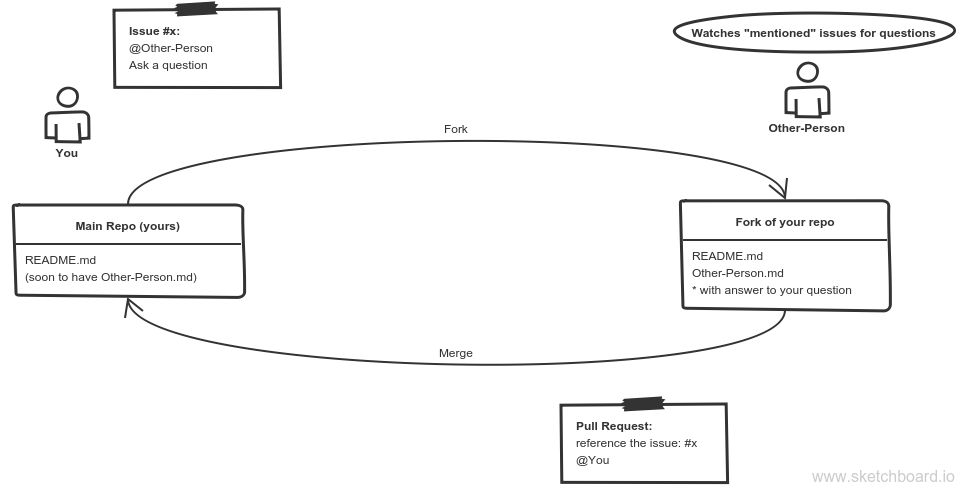

# Pull Requesting & Merging

There's a lot of code in your future, keeping track of it all is won't be easy.

Practice this simple exercise a few times a week so collaboration on GitHub feels easy before you start collaborating on full projects.

 

### Index
* [Learning Objectives](#learning-objectives)
* [step-by-step](#step-by-step)
* [Resources](#resources)

-------------

## Learning Objectives

* Pull Request workflow

[TOP](#index)

---

## step-by-step

Repeat this mini project until it is easy:
1. Setup - On your GitHub account:
  1. Open a new repository and call it something like "study-buddies".
  2. Make a simple README (so your repo can be forked)
2. Project - take turns assigning issues and making pull requests:
  * Go around the circle taking turns as "repository owner (RO)" - the person who started the repo and who merges pull requests
  1. The RO will ask questions:
    1. Create on issue in their repo for each person in the group
      * Use the issues to ask each person a question like, "do you have brothers or sisters?"
      * Mention the person you're asking in the body of the issue (ie. @username)
  2. Each person will answer their RO's question:
      1. Find your mentioned issues in issues/mentioned
      2. Follow the link to the project repo
      3. Create a fork of the RO's repo
      4. In the fork, create a new file and answer their question
      5. Send them a pull request, mention your issue in the body (ie. #3)
  3. The RO will accept or reject each answer:
      1. Check pull requests
      2. Review the answers
      3. Either merge, or ask for better answers
      4. Close each person's issue once you've accepted their answers
  4. Visualize your forks and merges as a graph like in learngitbranching
      1. Go to the RO's repository
      1. Click on "Insights" in the menu below the repository name
      1. Click on "Network" in the panel on the left
      1. Voila!  The forks and merges will be drawn like a graph of bubbles and arrows

[TOP](#index)

---

## Resources

GitHub Project Management Features:
* [Project Board Walk Through](https://medium.com/@dawsonbotsford/how-to-use-github-projects-aa15a8411b72)
* [Overview Article](https://www.lullabot.com/articles/managing-projects-with-github)
* [GitHub's PM Webinar](https://www.youtube.com/watch?v=6fByt0o4UYs)
* Guides:
  * [Managing your Work withIssues](https://help.github.com/articles/managing-your-work-with-issues/)
  * [Labeling Issues & PR's](https://help.github.com/articles/labeling-issues-and-pull-requests/)
  * [Tracking Progress with Projects](https://help.github.com/articles/tracking-the-progress-of-your-work-with-project-boards/)
  * [Tracking Progress with Milestones](https://help.github.com/articles/tracking-the-progress-of-your-work-with-milestones/)
  * [Finding Info in a Repo](https://help.github.com/articles/finding-information-in-a-repository/)

Workflow Methodologies:
* [Agile](https://www.visualstudio.com/learn/what-is-agile/)
* [Scrum](https://www.scrum.org/resources/what-is-scrum)
* [Lean](http://www.disciplinedagiledelivery.com/lean-principles/)
* [Kanban](https://www.sitepoint.com/how-why-to-use-the-kanban-methodology-for-software-development/)
* [Waterfall](https://airbrake.io/blog/sdlc/waterfall-model)
* [(VERY) Thorough Comparison](https://www.smartsheet.com/agile-vs-scrum-vs-waterfall-vs-kanban)

[TOP](#index)

___
___
### <a href="http://janke-learning.org" target="_blank"></img> Janke Learning</a>
